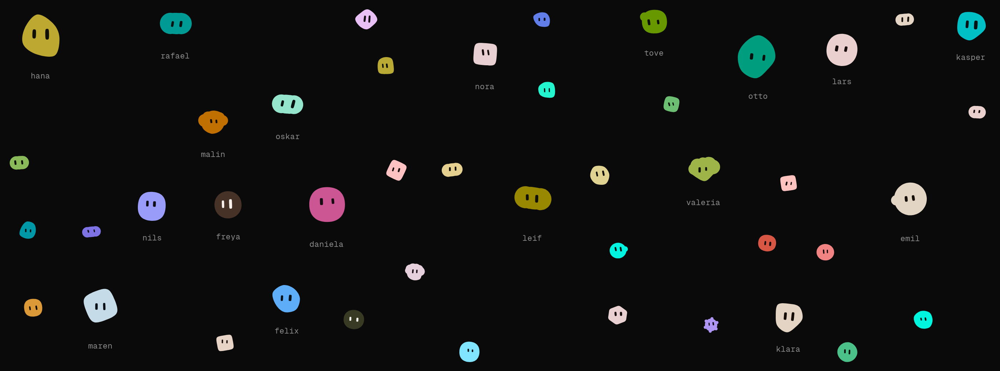
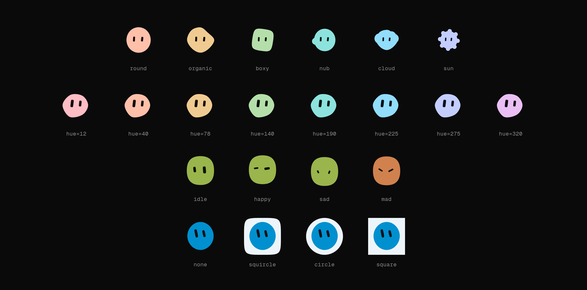

# blobatar

Deterministic geometric blobatars from any string. No dependencies, ~3.7 KB
gzipped.



```sh
bun add blobatar    # npm / pnpm / yarn all work too
```

## Usage

A blobatar always stands for somebody — a user, a bot, a team, a repo — so the
value it is generated from is that somebody's `name`: a username, a display
name, an email, a handle, an id. Any string works, and the same string always
renders the same blobatar.

### React

```tsx
import { Blobatar } from "blobatar/react";

<Blobatar name={user.email} size={48} />;
```

Everything but `name` is optional. Remaining props land on the underlying
element, so `className`, `alt` and the rest behave as you would expect.

### Anywhere else

`blobatar()` returns SVG markup as a string, and `blobatarUri()` wraps it in a
`data:` URI for `` or `background-image`:

```ts
import { blobatar } from "blobatar";
import { blobatarUri } from "blobatar/uri";

blobatar("alain@example.com"); // '<svg xmlns="..." viewBox="0 0 100 100">…'

el.style.backgroundImage = `url("${blobatarUri(user.id)}")`;
```

The main entry also carries the palette and trait utilities. If all you do is
render, import the renderer on its own and save about a kilobyte:

```ts
import { blobatar } from "blobatar/blob";
```

### Configuring

Options are the same for both APIs. `background`, `hue` and `tone` cover the
common cases; `traits` pins any individual axis as the 0–1 position the hash
would otherwise have produced:

```tsx
<Blobatar name={user.email} background="circle" hue={210} size={48} />;

// Always a sun with wide eyes — colour and everything else still per name.
blobatar(user.email, { traits: { shape: 0.95, "eye.ratio": 0 } });
```

Keys you leave out still come from the name — lock the two things that carry
your brand, and every user still gets their own creature. Pin everything and the
name stops mattering, which is how you build one fixed blobatar.

Every value those options take, and what each one draws:



### Your own vocabulary

The ten silhouettes ship as importable values, and a generation is just a table
of them weighted, plus a strategy for fitting the eyes. Want three shapes
instead of ten? Compose three:

```ts
import { compose, bodyFit, type Band } from "blobatar/compose";
import { round, organic, sun } from "blobatar/shapes";

const bands: Band[] = [[round, 0.5], [organic, 0.9], [sun, 1]];
const mine = { id: 7, ...compose(bands, bodyFit) };

blobatar(user.email, { generation: mine });
```

You carry only the shapes you name, so this comes out *smaller* than the default
import — and the containment guarantees still hold, because these are the same
shape values `gen1` and `gen2` are built from. Pick an `id` nothing else uses,
and treat your band table as frozen once you ship it: nudging an edge later
changes somebody's avatar. See the [package
README](./packages/blobatar/README.md#composing-your-own-generation).

### Animation and expressions

Both are opt-in. `animate` idles the blobatar — breathe, bob, blink, glance —
and expressions are imported as values so you ship only the poses you use:

```tsx
import { Blobatar } from "blobatar/react";
import { happy } from "blobatar/expression";
import "blobatar/motion.css"; // required — nothing animates without it

<Blobatar name={user.email} animate="hover" expression={happy} size={64} />;
```

`animate` changes the rendering mode: a static blobatar is a single ``, an
animated one is inline SVG. Use `"hover"` in a grid and `"always"` for the
single-blobatar case. Motion respects `prefers-reduced-motion`.

## Over HTTP

No install and no build step — a URL that renders one:

```html

```

The path segment is the name, percent-encoded, and the query string is the
options under the names the library gives them — `size` (or `s`), `background`,
`hue`, `tone`, `expression`, `title`, `gen`:

```
https://blobatar.dev/avatar/alain%40example.com?size=64&background=squircle
https://blobatar.dev/avatar/team-rocket?expression=smug
```

Gravatar's `d`, `f` and `r` are accepted and ignored, so an existing Gravatar
URL becomes a blobatar by changing the host and nothing else:

```diff
- https://www.gravatar.com/avatar/<hash>?s=200&d=identicon
+ https://blobatar.dev/avatar/<hash>?s=200&d=identicon
```

The hash is used as the name. It is one-way, so the email cannot be recovered —
but it is itself derived from the email, so each person still gets one stable
blobatar of their own. It will not be the same one `/avatar/<email>` gives:
pick one scheme per application.

`gen` picks the shape vocabulary. New silhouettes cannot be added without
reshuffling existing ones — the thresholds partition a single range — so they
arrive as a new **generation** instead:

| | silhouettes |
| --- | --- |
| `gen=1` | round, organic, boxy, nub, cloud, sun |
| `gen=2` | …and capsule, triangle, hexagon, droplet |

An unversioned URL renders gen 1 forever, so nothing you have already pasted
anywhere needs revisiting and gen 2 is something you ask for. Naming a
generation also makes the promise explicit, and earns a year-long immutable
cache rather than a day, since a pinned URL cannot come back different:

```
https://blobatar.dev/avatar/alain00?gen=1
https://blobatar.dev/avatar/alain00?gen=2
```

`GET /avatar/` returns the whole parameter list as plain text, which is the
reference this section is a summary of.

### Deploy your own

[](https://deploy.workers.cloudflare.com/?url=https://github.com/Alain00/blobatar/tree/main/apps/api)

`blobatar.dev/avatar` is free to use, but it is one small Worker rather than
something you have an agreement with, and it is rate-limited. If avatars are
load-bearing for you, run the endpoint yourself. The button clones
[`apps/api`](./apps/api) into your GitHub or GitLab account and deploys it to
your Cloudflare account — no configuration, no card, about a minute — and you
get:

```
https://blobatar-api.<your-subdomain>.workers.dev/avatar/<name>
```

Attach your own hostname afterwards in the Cloudflare dashboard, or as a
`routes` entry in `wrangler.jsonc`, and every push to your clone redeploys.

It stays inside the Workers free plan for anything short of real scale:
100,000 requests a day, and a blobatar costs 12µs of CPU against the 10ms
allowed per request and 357 gzipped bytes to send. There is no database, no
bucket and no state — the avatar is a pure function of the URL, which is also
why every cache between you and it does the actual work.

**[Full docs — options table, guarantees, and how it works →](./packages/blobatar/README.md)**

## Workspace

| Path                | What it is                                                        |
| ------------------- | ----------------------------------------------------------------- |
| `packages/blobatar` | The library. [Docs here](./packages/blobatar/README.md).          |
| `apps/api`          | The HTTP endpoint, deployable on its own. Serves `/avatar/<name>`. |
| `apps/site`         | The landing page, plus `apps/api` behind blobatar.dev.            |
| `apps/demo`         | The tuning grid — the internal design tool, not a demo.           |

```sh
bun install
bun dev        # tuning grid   → localhost:3001
bun site       # landing page  → localhost:3000
bun api        # the endpoint  → localhost:8787/avatar/alain
bun test       # library tests
bun run check  # tests + size budgets
bun run media  # redraw the README images (needs Chrome + ImageMagick)
```

[`CONTEXT.md`](./CONTEXT.md) is the glossary — worth two minutes before changing
anything, since `shape` and the `name`/`seed` split mean specific and
easily-confused things here. Architectural decisions live in [`docs/adr/`](./docs/adr/).
